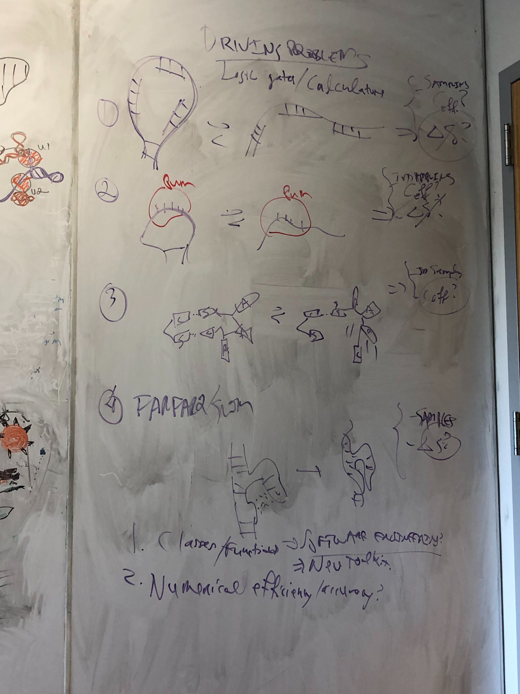

# ToyFold
Calculations and simulations of RNA tertiary structure in a 2D toy model

## Goals
* Bead model of RNA-like folding in 2D.
* Allow rapid simulations to test partitition function calcs -- including tertiary structure -- in MATLAB.
* Test factorization of free energy in terms of local motif energy (including K_d); motif modularity costs; tertiary closure.
* Test simple analytic representations of translation/rotation SE(2) distributions in tertiary closure costs, including Gaussian models and harmonic transforms.
* Easy-to-understand visualization in 2D.

## Notes
* Go to 'large-N' limit where beads have large alphabet to define unambiguous pairings for secondary and tertiary structure.
* use springs to connect nearest neighbor beads at `R`.
* define a flat-bottom well potential to connect paired beads at `2 x R`. Will allow pseudoknots.
* create a simple A-minor type tertiary interaction for one bead color and cognate _pair_ of beads.
* Goal (for a paper) -- compare analytical predictions of $\DeltaG$ with numerical simulations for a bunch of designed structures, including: hairpin, pseudoknots, kissing loops, cdiAMP-riboswitch-like squares, and P4-P6 like A-minor conformations.

